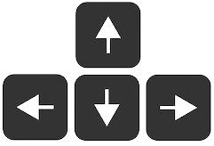

> [!WARNING]
> El juego DE MOMENTO esta en desarrollo hay cosas que no funcionan y otras que todavia no estan planteadas, voy a mi ritmo, poco a poco.

> [!NOTE]
> Tened en cuenta que como este juego esta hecho en HTML, CSS, JS y se esta ejecutando en el navegador, no va todo lo fluido que seria un juego normal ejecutandose en el ordenador.

### 🌍 Un juego más de mundo abierto
Este juego consta de un mapa de mundo abierto dividido en cuadrados de 12x12 (default) generados de manera aleatoria.
Puedes explorar, matar enemigos e intentar sobrevivir el mayor tiempo posible, como tal este juego no tiene un objetivo fijo (de momento, en un futuro nunca se sabe) solo disfrutar y sobrevivir.

### 🎮 Controles

Movimiento:  | 
>

Abrir cajas: 

